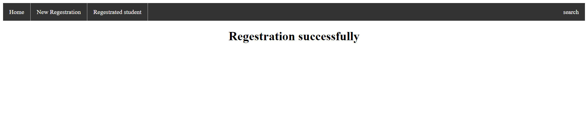

<h1>Student registration form with backend</h1>

In this project i used a python in django framework.In this project a student write all the details in the form after it show in the table which it filled

<h2>How to work project is show in below in step by step images</h2>
<h3>Step 1: The layout of project </h3>

<h3>Step 2: After clicked of New registration </h3>

<h3>step 3: After filled all details</h3>

<h3>step 4: If you clicked a Regestrate button it redirect to response </h3>

<h3>step 5: After you clicked regestrate button you showed your details which you filled </h3>

